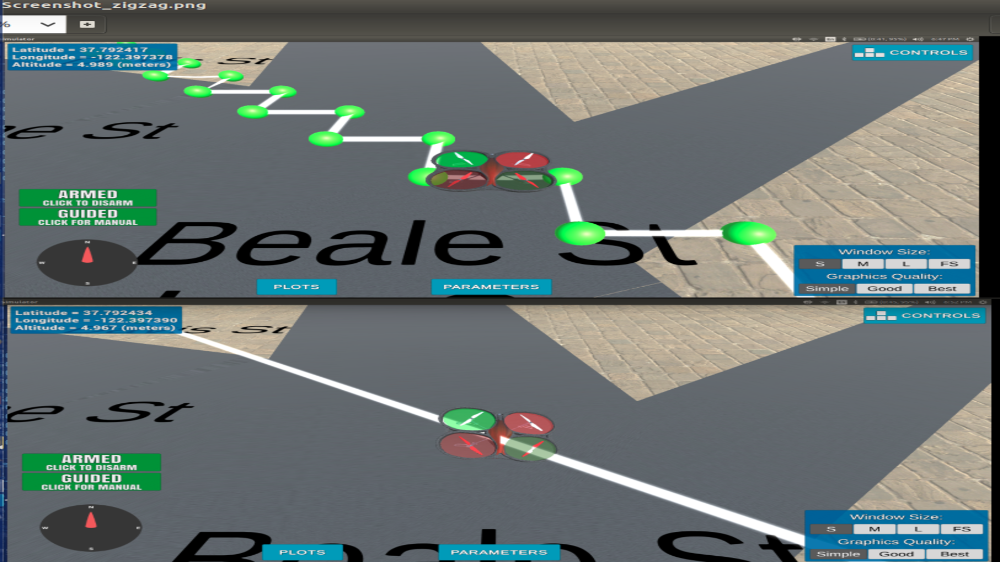

## Project: 3D Motion Planning

---

## [Rubric](https://review.udacity.com/#!/rubrics/1534/view) Points
### Here I will consider the rubric points individually and describe how I addressed each point in my implementation.  

---

### Explain the Starter Code

#### 1. Explain the functionality of what's provided in `motion_planning.py` and `planning_utils.py`
These scripts contain a basic planning implementation that includes python definitions in two files, `motion_planning.py` and the `planning_utility.py`.

The main of the program is called `plan_path()` resides in the `motion_planning.py`. It starts by reading the latitude and longitude of the home location in floating points from the external 2.5D `colliders.csv` map file.

The starter code reads in the obstacle map, runs a simple path from the center of the map (-`north_offset`, -`east_offset`), to (-`north_offset` - 10, -`east_offset` - 10). It then defines a grid for a particular altitude and safety margin around obstacles. It finally utilizes the A* search algorithm to find the optimum path from start to goal.

As can be seen from running the starter code without any modification, the drone flies in a zig-zag fashion from the A* seach algorithm. The zig-zag can be smoothed out by pruning the path using `collinearity` algorithm. The result is shown here.

After exploring the starter code, I am ready to build my own path planning algorithms that I have learnt from class. I will provide 2 solutions, one for the basic requirement, which is a `grid-based` A* path, and second a `graph-based` A* path planning algorithms. They are provided in two zip files `Grid_based_search.tgz` and `Graph_based_search.tgz`

### Implementing My Path Planning Algorithm

#### 1. Set my global home position
First we need to set the global home position. The position is provided in the first line of the `colliders.csv` file. To read only the first line of the `colliders.csv` file in order to retrieve the home position, I created a module definition called `readrow0()`. The latitude, and longitude is then passed to the self.set_home_position() method to set the global home position.

#### 2. Set my current local position

Next, we need to know our current local position in NED format relative to global home. Once the global home position and the current global position is known, the NED current local position can be calculated from the global_to_local() method.

#### 3. Set grid start position from local position

The grid starting position can be then be provided from the current position relative to the map center.

#### 4. Set grid goal position from geodetic coords
This step is to add flexibility to the desired goal location. Should be able to choose any (lat, lon) within the map and have it rendered to a goal location on the grid.

Similarly, the grid_goal position can be calculated from any ( lat, lon ) within the map.

#### 5. Modify A* to include diagonal motion (or replace A* altogether)

In my basic requirement implementation `Grid_based_search` solution, I modify the code in planning_util() to update the A* implementation to include diagonal motions on the grid that have a cost of sqrt(2). I also provided another solution which is graph base, `Graph_based_search`. 

The graph based solution is using Voronoi algorithm to provide the cells. The create_grid_and_edges() method is called to generate the Voronoi edges. The algorithm also checks each edge from the graph.ridge_vertices for collision.

Using the import from networkx, the graph is created from the Voronoi edges by G.add_edge() method. This is shown in the python code below.

G = nx.graph()
for e in edges:
  p1 = e[0]
  p2 = e[1]
  dist = LA.norm(np.array(p2) - np.array(p1))
  G.add_edge (p1, p2, weigh=dist)

#### 6. Cull waypoints 
For the final step I use a collinearity test to prune my path of unnecessary waypoints. 

### Execute the flight
#### 1. Does it work?
It works!

### Double check that you've met specifications for each of the [rubric](https://review.udacity.com/#!/rubrics/1534/view) points.
  
# Extra Challenges: Real World Planning

For an extra challenge, consider implementing some of the techniques described in the "Real World Planning" lesson. You could try implementing a vehicle model to take dynamic constraints into account, or implement a replanning method to invoke if you get off course or encounter unexpected obstacles.

I am not doing the `Extra Challenges`, tempted but too complicated to do right now :)

